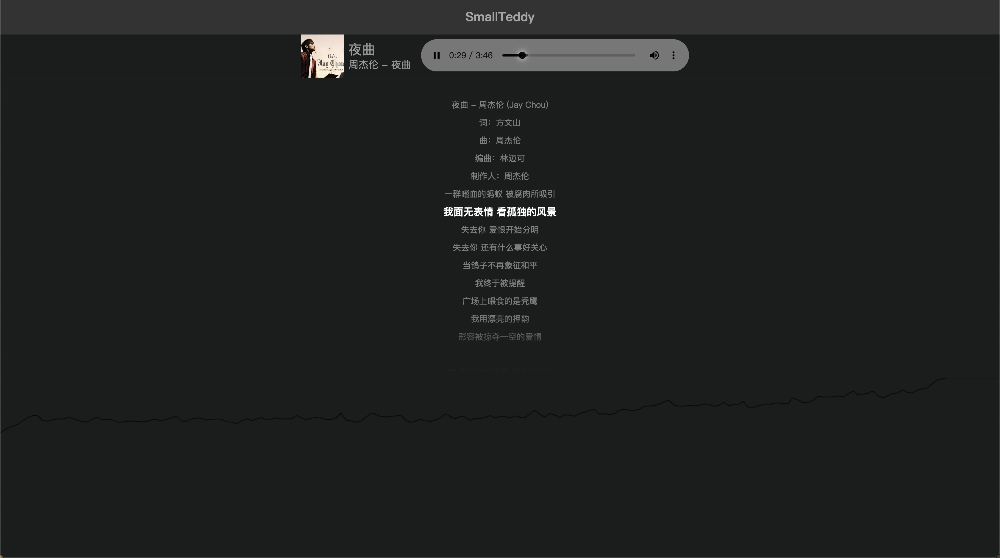

# Testing Web

## 项目说明

```
｜ 项目由 vue3 + vite + vue-router + element-plus + sass + ts 搭建
｜ 采用 unplugin-auto-import 和 unplugin-vue-components 做自动导入
｜ vue 等相关生命周期可直接使用
```

### 安装

```
｜ 采用yarn进行node包管理
｜ yarn 安装依赖
｜ yarn dev 运行开发环境
｜ yarn build 打包发布
```

### Demo

</img>
